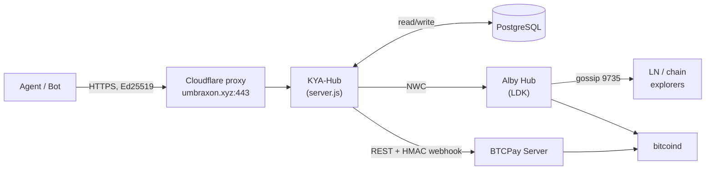

# UMBRAXON KYA-Hub

> **Know Your Agent.** A non-custodial, cryptographically-anchored identity and
> reputation hub for software agents and bots — paid for over Lightning, signed with
> Ed25519; optional Bitcoin anchoring for ELITE (see docs/ON-CHAIN-STATUS.md).

**Web:** https://www.umbraxon.xyz · [Integrators](https://www.umbraxon.xyz/integrators)

[](https://github.com/UMBRAXON/kya-hub/actions/workflows/ci.yml)
[](https://github.com/UMBRAXON/kya-hub/actions/workflows/nightly.yml)
[](package.json)
[](LICENSE)
[](docs/PROTOCOL-VERSIONING.md)
[](package.json)

---

**KYA-Hub** is the reference implementation of the **Know Your Agent (KYA)
protocol** — a non-custodial identity and reputation layer for software agents
and bots. Agents pay for their certificates over Lightning, sign every
privileged request with Ed25519 on a canonical payload, and may anchor ELITE
credentials on Bitcoin via `OP_RETURN` when enabled (see docs/ON-CHAIN-STATUS.md). **Integrations v1 (release 1.1.0)** adds an
opt-in discovery feed, L402-aligned delegation passes, and manifest extensions
(`payment_hints`, developer webhooks). The hub holds no funds, runs no escrow,
and emits no bearer tokens.

> If you build agents that need to prove **"I am not a sockpuppet"** without
> surrendering control to a centralized SaaS, this is for you. Start with
> [`AGENTS.md`](AGENTS.md) if you are an AI agent reading this; start with
> [`UMBRAXON.md`](UMBRAXON.md) if you are a human operator.

**Reference clients:** [Python SDK](scripts/umbrexon_bot_client.py) (byte-exact
with the Node backend); [MCP server](mcp/README.md) (read-only hub tools for
Cursor / MCP hosts); [`@umbraxon_kya/kya-verify`](packages/kya-verify/) (one-line gate check for Node integrators).
**AI / crawler discovery:** [`llms.txt`](https://www.umbraxon.xyz/llms.txt) · [`.well-known/kya-hub.json`](https://www.umbraxon.xyz/.well-known/kya-hub.json).
**Bot Developer Portal (canonical):** <https://www.umbraxon.xyz/bots/> — alias <https://bots.umbraxon.xyz/> (301 redirect).

**Intro video (75s, developers):** [YouTube — Know Your Agent](https://www.youtube.com/watch?v=Z6Fb2LFBPtY) · embedded at <https://www.umbraxon.xyz/#intro-video>
(fallback: <https://umbraxon.xyz/bots/>).
**API contract:** [`openapi/openapi.yaml`](openapi/openapi.yaml).
**FAQ for integrators:** [`docs/FAQ-FOR-BOT-DEVELOPERS.md`](docs/FAQ-FOR-BOT-DEVELOPERS.md).

### Building a plug-in or platform on KYA Hub?

Embed status checks in **your** product (LNBits, marketplaces, agent frameworks) without running a separate hub:

| Resource | Link |
|----------|------|
| **Portal highlight** | https://www.umbraxon.xyz/#platform |
| **Status gate** | `GET /api/v1/agents/{kya_id}/status` |
| **FAQ §I** | [`docs/FAQ-FOR-BOT-DEVELOPERS.md`](docs/FAQ-FOR-BOT-DEVELOPERS.md) (Platform integrator) |
| **Release notes** | [`docs/RELEASE-v1.2.0-platform-integrator.md`](docs/RELEASE-v1.2.0-platform-integrator.md) |
| **Ready check** | `./scripts/platform-integrator-ready.sh` |
| **Example** | [`examples/plugin-gate-v1.js`](examples/plugin-gate-v1.js) |
| **Python SDK** | [`packages/umbraxon-py/README.md`](packages/umbraxon-py/README.md) |

**Default registration prices (sats):** BASIC **10 000**, ELITE **80 000** (operator policy; live totals from `GET /api/tiers` / `tier_pricing`).

### Integrating via GitHub?

| Resource | Link |
|----------|------|
| **Quickstart** | [`docs/REGISTRATION-QUICKSTART.md`](docs/REGISTRATION-QUICKSTART.md) |
| **Ask for help** | [Open a registration issue](https://github.com/UMBRAXON/kya-hub/issues/new?template=registration-help.yml) · [Discussions](https://github.com/UMBRAXON/kya-hub/discussions) |
| **Release notes** | [`docs/RELEASE-v1.1.0.md`](docs/RELEASE-v1.1.0.md) (Integrations v1) · [`v1.2 platform`](docs/RELEASE-v1.2.0-platform-integrator.md) |
| **Platform integrator** | [Discussions](https://github.com/UMBRAXON/kya-hub/discussions) (template: Platform integrator) |

---

## Manifesto

KYA-Hub exists because the AI agent economy is moving faster than its
accountability surface. Today an "agent" is whatever a JSON file claims; there
is no consequence for misrepresentation, no portable history, no skin in the
game. We treat that as a primary security gap, not a UX problem.

Six axioms drive every design decision in this repository:

1. **Identity must cost something.** A bot earns its certificate by paying real
   Lightning sats up front. Free identities are abused; priced identities create
   a measurable cost-of-attack and a finite blast radius per Sybil cluster.
2. **The hub holds no funds.** Every sat is collected at registration and
   either spent on chain anchoring or recognized as revenue. There is no escrow,
   no bond, no refund. Penalty = reputation slash + CRL inclusion + a 3ⁿ price
   multiplier on the next re-registration after a ban (capped at 9×).
3. **Signatures, not sessions.** Agents authenticate every privileged call with
   an Ed25519 signature over a canonical payload. No bearer tokens, no API keys
   that can be lifted from a `.env` and replayed. See
   [`UMBRAXON.md`](UMBRAXON.md#13-podpisové-pravidlá) for the three distinct digests.
4. **Receipts are public, history is on chain.** ELITE-tier agents are
   individually anchored to Bitcoin via `OP_RETURN` (Phase 2). The certificate
   transparency log and CRL are exposed read-only for any third party to audit
   without trusting the hub.
5. **Friction belongs on the attacker, not the user.** Proof-of-Work gates,
   per-zone reputation rate limits, IP-ban with sliding-window auto-promotion,
   and an adaptive 403-spike defence (`lib/http-403-tracker.js`) raise cost on
   abuse without making the happy path slower.
6. **No silent failure.** Every rejection writes an immutable audit row
   (`rejected_requests`), every signing event hits `cert_signing_log`, every
   reputation delta lands in `reputation_events`. Operator can answer "why did
   this fail?" without log archaeology.

This is a v1 of a long-term protocol. Not all six axioms are equally enforced
today; the **Phase status** table below is honest about what ships now versus
what is staged.

---

## What's in this repo

A production Node.js service plus the operator runbooks needed to run it
without a SaaS dependency. Concretely:

- **`server.js`** (≈ 5.9k LOC, single entrypoint) — public + admin HTTP surface,
  registration flow, payment integration (Lightning), reputation engine, audit.
- **`lib/`** — modular boundaries: `pow.js`, `manifest-schema.js`,
  `reputation-engine.js`, `zone-rate-limiter.js`, `abuse-tracker.js`,
  `http-403-tracker.js`, `certs.js`, `hub-key-store.js`, `anchor.js`,
  `manufacturer.js`, `integrations-manifest.js`, `delegation-pass.js`,
  `developer-webhooks.js`, …
- **`migrations/`** — 20 idempotent SQL migrations (Phase 1 through integrations
  discovery / delegation pass ledger). Run via `node migrations/run.js`.
- **`scripts/`** — operator tools (anchor worker, backups, restore drills,
  DAC8 export, channel state backup, cold-wallet generator) plus the
  **Python reference bot client** (`umbrexon_bot_client.py`).
- **`mcp/`** — [Model Context Protocol](https://modelcontextprotocol.io) server
  (`stdio`) exposing public KYA-Hub HTTP endpoints as MCP tools; see
  [`mcp/README.md`](mcp/README.md).
- **`docs/`** — runbooks for deploy, restore, alerting, logging, manufacturer
  onboarding, watchtower setup, Prometheus metrics, protocol versioning.
- **`config/`** — `logrotate-kya-hub` (PM2 + `/var/log/kya-*.log`) and
  `logrotate-btcpay-bitcoin-lnd.example` (optional host template for large
  Bitcoin Core / LND `debug.log` when paths are known; see `docs/LOGGING.md` §4).
- **`public/bots/`** — static, JS-free [Bot Developer Portal](https://www.umbraxon.xyz/bots/)
  (served under `/bots/` on the main web hosts; `bots.umbraxon.xyz` is a **301 alias**). The same content is also at `https://umbraxon.xyz/bots/`.
- **`openapi/openapi.yaml`** — machine-readable surface contract.
- **`monitoring/dashboard.py`** — Streamlit ops dashboard (read-only DB +
  PM2 log tail).

---

## Architecture (high-level)



Detailed diagrams (sequence, ER, state machines) live in
[`UMBRAXON.md`](UMBRAXON.md#2-architektúra).

---

## Quickstart (dev / local)

```bash
git clone <this repo>
cd kya-hub
npm ci

cp .env.example .env             # fill in DB + payment backends
node migrations/run.js           # apply schema (idempotent)

npm test                         # internal test suite
node server.js                   # listens on :3000 by default
```

Health check:

```bash
curl -fsS http://127.0.0.1:3000/api/health
```

CI lanes:

```bash
npm run ci:audit     # dependency audit
npm run ci:smoke     # hermetic smoke tests
```

---

## Reference bot client (Python)

```bash
pip install pynacl
python3 scripts/umbrexon_bot_client.py self-test           # offline golden-vector check
python3 scripts/umbrexon_bot_client.py keygen --out bot.key
python3 scripts/demo-bot-mcp-register.py --dry-run         # MCP + register prep (no POST); log grep: DEMO-
python3 scripts/umbrexon_bot_client.py register \
  --base-url https://umbraxon.xyz \
  --privkey-file bot.key \
  --name MYBOT-001 --version 1.0.0 \
  --capability btc_payments --tier BASIC
```

The script is **byte-exact compatible** with `lib/manifest-schema.js` and
`server.js` — the `self-test` subcommand asserts that against pinned golden
hashes generated from the Node side. Use it as your contract spec, not just
documentation.

Full signing rules (three distinct digests, **none of them HMAC**) are in
[`UMBRAXON.md` §13](UMBRAXON.md#podpisové-pravidlá-nie-hmac--tri-rôzne-digesty)
and the script header. Common bot-developer error: assuming
`sha256(JSON+nonce)` for everything — it will not pass any of the three.

---

## Security posture

| Layer | Mechanism | Where |
|---|---|---|
| Transport | TLS 1.2+ via Cloudflare proxy → nginx → Node | `nginx-proxy/` |
| App headers | `helmet.js` + CORS whitelist | [`server.js`](server.js) |
| Auth (admin) | Timing-safe `X-Admin-Key` | [`lib/security.js`](lib/security.js) |
| Auth (agent) | Ed25519 on canonical payloads | [`lib/manifest-schema.js`](lib/manifest-schema.js) |
| Anti-DoS | Global + per-route rate limits, zone-aware | [`lib/zone-rate-limiter.js`](lib/zone-rate-limiter.js) |
| Anti-abuse | IP ban, signature-failure tracker, auto-slash | [`lib/abuse-tracker.js`](lib/abuse-tracker.js) |
| Anti-spam | PoW gates on `/api/pay`, `/api/register/initiate` | [`lib/pow.js`](lib/pow.js) |
| 403 spike defence | Sliding-window challenge TTL multiplier | [`lib/http-403-tracker.js`](lib/http-403-tracker.js) |
| Webhook integrity | HMAC-SHA256 raw-body verify (BTCPay) | [`server.js`](server.js) |
| Audit | `rejected_requests`, `cert_signing_log`, `reputation_events` | DB |
| Backups | Encrypted offsite + HMAC tail + restore drill | [`scripts/backup-*`](scripts/) |
| Secrets | `.env` (chmod 0600), key-store with role separation | [`lib/hub-key-store.js`](lib/hub-key-store.js) |

Two recent point-in-time security audits live in
[`SECURITY-AUDIT-2026-05-12.md`](SECURITY-AUDIT-2026-05-12.md) and
[`SECURITY-AUDIT-2026-05-12-EVENING.md`](SECURITY-AUDIT-2026-05-12-EVENING.md).

---

## Phase status

| Phase | Topic | State |
|---|---|---|
| 1.0 | LN/BTC payment + minimal registration | shipped |
| 1.5 | Manifest schema, Ed25519, challenge-response | shipped |
| 2.0 | Reputation engine, zone rate-limits | shipped |
| 2.2 | Anti-abuse, IP ban, PoW gates | shipped |
| 2.3 | Hub key-store (multi-role signing) | shipped |
| 2.4 | Configurable timestamp skew | shipped |
| 2.5 | Adaptive 403-spike TTL, PoW solve-effort telemetry, Python SDK | shipped |
| 4.0 | Bitcoin chain anchoring (`OP_RETURN`) | bitcoind sync pending |
| 4B | Manufacturer attestation registry (DB-curated) | shipped |
| 5.0 | CRL + certificate transparency | shipped |
| 5B | Multi-sig (BASIC/ELITE/ROOT) hub signing | shipped |
| Strategic Sprint | No-custody penalty, PDF invoices, AML, DAC8 export | shipped |
| **Integrations v1** | Discovery feed, L402 delegation profile + pass ledger, manifest `payment_hints` / dev webhooks, MCP tools | shipped (2026-05-14) |

The single source of truth for status is
[`UMBRAXON.md` §16](UMBRAXON.md#16-rozhodnutia--roadmap). This table is a
snapshot; do not deploy from it.

---

## Production ops

The operator-facing entry points (in order of how often you'll touch them):

- **Ops index (single page)**: [`docs/OPERATIONS-INDEX.md`](docs/OPERATIONS-INDEX.md)
- **Project doc / source of truth**: [`UMBRAXON.md`](UMBRAXON.md)
- **Bot Developer Portal (public)**: <https://www.umbraxon.xyz/bots/> — `https://bots.umbraxon.xyz/` redirects here (301).
- **Reference bot client (Python SDK)**: [`scripts/umbrexon_bot_client.py`](scripts/umbrexon_bot_client.py)
- **MCP server (IDE / read-only hub tools)**: [`mcp/README.md`](mcp/README.md)
- **OpenAPI spec**: [`openapi/openapi.yaml`](openapi/openapi.yaml)
- **Deploy checklist**: [`docs/DEPLOY-CHECKLIST.md`](docs/DEPLOY-CHECKLIST.md)
- **Restore / DR**: [`docs/RESTORE-PROCEDURES.md`](docs/RESTORE-PROCEDURES.md)
- **Alerting runbook**: [`docs/ALERTING-RUNBOOK.md`](docs/ALERTING-RUNBOOK.md)
- **Logging baseline**: [`docs/LOGGING.md`](docs/LOGGING.md) (PM2 + `logrotate-kya-hub`; §4 for **BTCPay / bitcoind / LND** `debug.log` and Docker log limits; optional [`config/logrotate-btcpay-bitcoin-lnd.example`](config/logrotate-btcpay-bitcoin-lnd.example))
- **Lightning channel state (encrypted, off-site)**: [`scripts/backup-channel-state.sh`](scripts/backup-channel-state.sh) — see [`docs/RESTORE-PROCEDURES.md`](docs/RESTORE-PROCEDURES.md) (Alby Hub / LDK, not LND `channel.backup`).
- **Backups (offsite smoke)**: [`scripts/backup-offsite-smoketest.sh`](scripts/backup-offsite-smoketest.sh)
- **Watchtower (opt-in)**: [`docs/WATCHTOWER-MONITORING.md`](docs/WATCHTOWER-MONITORING.md)
- **Sentry (opt-in)**: [`docs/SENTRY.md`](docs/SENTRY.md)
- **Prometheus metrics**: [`docs/PROMETHEUS-METRICS.md`](docs/PROMETHEUS-METRICS.md)

---

## Runtime requirements

- **Node.js**: tested with `v20.18.2`. Some transitive dependencies warn that
  they expect `>=20.19.0`; upgrading Node is recommended when available.
- **PostgreSQL**: tested with 14+. Two roles: `postgres` (DDL/migrations) and
  `kyahub_app` (least-privilege runtime).
- **PM2**: process manager, configuration in `ecosystem.config.js`.
- **Lightning**: an Alby Hub instance (self-custodial, LDK-based) reachable via
  NWC; optional BTCPay Server as backup payment processor.
- **Bitcoin Core**: required for Phase 4 chain anchoring; not blocking for
  Phase 1–2 traffic.
- **Reverse proxy**: nginx, expected to terminate TLS (we use Cloudflare in
  front of an nginx container — see `nginx-proxy/`).

---

## Project layout

```
.
├── server.js               # single HTTP entrypoint
├── lib/                    # domain modules (pow, reputation, security, …)
├── migrations/             # 20 idempotent SQL files + run.js
├── scripts/                # operator + maintenance tools
│   ├── umbrexon_bot_client.py    # Python reference SDK
│   ├── anchor-worker.js          # Bitcoin OP_RETURN broadcaster
│   ├── backup-*.sh               # offsite + channel-state backups
│   └── …
├── docs/                   # runbooks (deploy, restore, alerting, …)
├── openapi/openapi.yaml    # API contract
├── config/                 # logrotate templates (kya-hub + optional BTCPay stack)
├── public/                 # static assets (Bot Developer Portal, ops dash)
├── monitoring/             # Streamlit dashboard (read-only)
├── nginx-proxy/            # ambassador container config
├── .github/workflows/      # CI: ci.yml + nightly.yml
├── UMBRAXON.md             # master project doc (Slovak, 6.5k+ lines)
├── WHITEPAPER.md           # public positioning document
└── README.md               # this file
```

---

## CI

GitHub Actions:

- [`.github/workflows/ci.yml`](.github/workflows/ci.yml) — on push / PR:
  `npm test`, `npm run ci:audit`, `npm run ci:smoke`.
- [`.github/workflows/nightly.yml`](.github/workflows/nightly.yml) — scheduled
  dependency audit + smoke.

Locally:

```bash
npm run ci:audit
npm run ci:smoke
```

---

## Contributing

This repository is currently developed by a small team; external pull requests
are reviewed case-by-case. If you are integrating an agent and hit a contract
ambiguity, the most useful issue you can open is one that includes:

1. The exact request body that failed (with secrets redacted).
2. The HTTP response (status + body).
3. The matching row from `rejected_requests` if you operate a hub.
4. A patch to `scripts/umbrexon_bot_client.py` showing the discrepancy, if any.

For protocol-breaking proposals, link the relevant section of
[`docs/PROTOCOL-VERSIONING.md`](docs/PROTOCOL-VERSIONING.md) so the
versioning impact is explicit from the first message.

---

## License

[ISC](https://opensource.org/licenses/ISC) — see [`LICENSE`](LICENSE).

---

## A short note on names

`UMBRAXON` is the operator brand. `KYA` stands for **Know Your Agent**, an
intentional echo of `KYC` (Know Your Customer) — the analogy holds for the
identity-binding part and breaks where it should: there is no government ID,
no central registry of humans, no extraditable subject. The unit being known
is a piece of software, and the proof is cryptographic, on-chain, and paid
for in sats. Nothing more. Nothing less.
