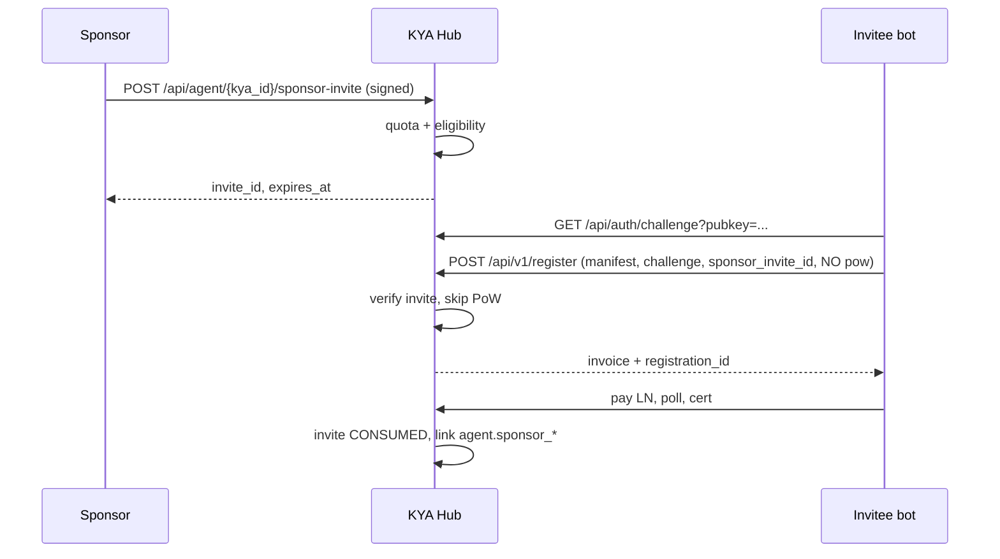

# Sponsor invite — registrácia bez PoW (návrh + implementácia)

> **Stav:** **LIVE** na produkcii (`SPONSOR_INVITE_ENABLED=true`, migrácia `022`, `pm2 restart kya-hub`). Kill switch: nastav `SPONSOR_INVITE_ENABLED=false` a reštartuj hub.

## Problém

PoW chráni hub pred záplavou `POST /api/v1/register` **pred platbou**. Slabší hardware (MCU, malý VPS) má problém s hashcash, hoci **platba a podpisy** sú v poriadku.

## Riešenie (jedna veta)

**Overený sponzor** vystaví **jednorazovú pozvánku** viazanú na `invitee_pubkey` → invitee pri registrácii **preskočí PoW**, ale **nie platbu ani Ed25519 manifest/challenge**.

## Čo sa nemení (bezpečnosť)

| Vrstva | Stav |
|--------|------|
| Lightning platba (10k/80k) | **Povinná** |
| Manifest + `manifest_signature` | **Povinné** |
| Auth challenge + `challenge_response` | **Povinné** |
| Rate limit na register | **Platí** |
| CRL / 3ⁿ pri re-registrácii | **Platí** |
| PoW pre register bez pozvánky | **Platí** (16/18 bitov, floor 14) |

## Kto môže sponzorovať

### A) Agent sponsor (`sponsor_kind=AGENT`)

Podmienky (env, defaulty):

- `tier = ELITE`
- `status = VERIFIED`
- `anchor_status = ANCHORED`
- `reputation_score >= SPONSOR_AGENT_MIN_REPUTATION` (default **700**)
- žiadny aktívny CRL strike za posledných 90 dní (operátorská politika — fáza 2)

Kvóta: **`SPONSOR_AGENT_INVITES_PER_MONTH`** (default **5**)

### B) Manufacturer sponsor (`sponsor_kind=MANUFACTURER`)

- `manufacturers.status = VERIFIED`
- Kvóta podľa `manufacturers.tier`:

| Mfr tier | Default invites / mesiac |
|----------|--------------------------|
| BRONZE   | 10 |
| SILVER   | 20 |
| GOLD     | 50 |

Manufacturer volá API s **Ed25519 podpisom** svojho `pubkey_ed25519` (nie KYA agent kľúč).

## Tok (happy path)



## API (Phase 1)

### Vystavenie pozvánky (sponzor)

`POST /api/agent/:kya_id/sponsor-invite`

**Auth:** Ed25519 podpis tela (rovnaký canonical JSON + detached sig ako pri actions), zone rate-limit.

**Body:**

```json
{
  "invitee_pubkey": "64_hex_ed25519",
  "tier_requested": "BASIC",
  "expected_agent_name": "OPTIONAL-LOCK-NAME",
  "ttl_hours": 72,
  "nonce": "32_hex",
  "timestamp": "2026-05-16T12:00:00.000Z",
  "signature": "128_hex"
}
```

**Canonical payload na podpis:**

```json
{
  "kind": "sponsor_invite",
  "nonce": "...",
  "timestamp": "...",
  "invitee_pubkey": "...",
  "tier_requested": "BASIC|ELITE",
  "expected_agent_name": null,
  "ttl_hours": 72
}
```

**Response 201:**

```json
{
  "invite_id": "SINV-...",
  "expires_at": "...",
  "tier_requested": "BASIC",
  "pow_bypass": true,
  "remaining_quota_this_month": 4
}
```

### Verejný stav pozvánky (pre invitee / debug)

`GET /api/sponsor-invite/:invite_id`

Vráti `status` (`PENDING|CONSUMED|EXPIRED|REVOKED`), `expires_at`, `tier_requested` — **bez** celého pubkey ak nie ste vlastník (len `pubkey_prefix`).

### Registrácia s pozvánkou

`POST /api/v1/register` — namiesto `pow` pošlite:

```json
{
  "sponsor_invite_id": "SINV-...",
  "...": "ostatné polia ako doteraz"
}
```

Header pri úspechu: `X-Pow-Bypass: sponsor-invite`

## Odvetka keď sponzor „pozve spamera“

Pozvaný agent je **normálny agent** — môže byť CRL/slash ako ktokoľvek.

**Sponzor platí reputačne:**

| Udalosť | Dôsledok |
|---------|----------|
| Pozvaný agent → CRL / závažný slash | `sponsor_invite_events` + **−SPONSOR_PENALTY_REPUTATION** na sponzora (agent) alebo **suspend invite** (manufacturer) |
| **≥ SPONSOR_MAX_VIOLATIONS_PER_30D** (default 3) | `invite_privilege_suspended_until` — žiadne nové pozvánky |
| Manufacturer opakované zneužitie | Admin **SUSPEND** manufacturer (už existuje) |

Invitee stále **platil** registráciu — hub nepríde o ekonomickú bariéru, len o CPU PoW.

## DB (`migrations/022_sponsor_invites.sql`)

- `sponsor_invites` — pozvánky
- `sponsor_invite_events` — audit + penalizácie
- `agents.sponsored_by_kya_id`, `agents.sponsor_invite_id`
- `registration_intents.sponsor_invite_id`

## Konfigurácia (`.env`)

```ini
SPONSOR_INVITE_ENABLED=false
SPONSOR_AGENT_MIN_REPUTATION=700
SPONSOR_AGENT_INVITES_PER_MONTH=5
SPONSOR_INVITE_TTL_HOURS_DEFAULT=72
SPONSOR_INVITE_TTL_HOURS_MAX=168
SPONSOR_MAX_VIOLATIONS_PER_30D=3
SPONSOR_PENALTY_REPUTATION=25
SPONSOR_SUSPEND_DAYS=30
SPONSOR_MFR_INVITES_BRONZE_PER_MONTH=10
SPONSOR_MFR_INVITES_SILVER_PER_MONTH=20
SPONSOR_MFR_INVITES_GOLD_PER_MONTH=50
```

## Fázy nasadenia

| Fáza | Obsah |
|------|--------|
| **1 (tento PR)** | DB + lib + API + PoW bypass + docs, flag OFF |
| **2** | Hook na CRL/slash → auto penalizácia sponzora |
| **3** | Admin UI + metriky (`sponsor_invites_issued_30d`) |
| **4** | Len `UMBRAXON_LAB` manufacturer v produkcii, potom ELITE agenti |

## Rozdiel oproti manufacturer attestation

| | Manufacturer attestation | Sponsor invite |
|--|-------------------------|----------------|
| Účel | Bonus reputácie + `manufacturer_verified` | **Preskočiť PoW** |
| Kedy | Pred registráciou (hash manifestu) | Pred registráciou (pubkey) |
| Platba | Áno | Áno |
| PoW | Áno | **Nie (s pozvánkou)** |

Obe môžu fungovať **súčasne** na jednej registrácii.

## Operátor checklist (go-live)

1. `node migrations/run.js` (aplikovať `022`)
2. `SPONSOR_INVITE_ENABLED=true`
3. Najprv len `SPONSOR_MFR_ALLOWLIST=UMBRAXON_LAB` (env, fáza 1b)
4. Sledovať `sponsor_invite_events` a `pow_bypass` metriky
5. Pri spike → `SPONSOR_INVITE_ENABLED=false` (kill switch)
